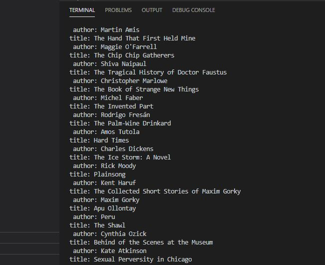

# MultiPageWebScraper

This is a multi page web scraper that pulls the title and the author from the pages of thegreatestbooks.org.  It was made from a crazy fun YouTube code along tutorial I found <a href src="https://www.youtube.com/watch?v=Dh9Ihheqyu8">here.</a>  Big shout out to the instructor Shane Lee!

It was made using Python and BeautifulSoup.  I might take this project one step further and have the data exported to HTML 

